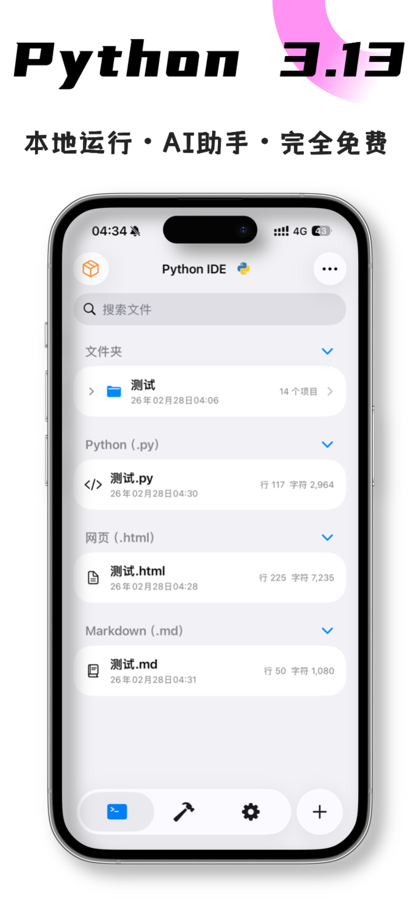
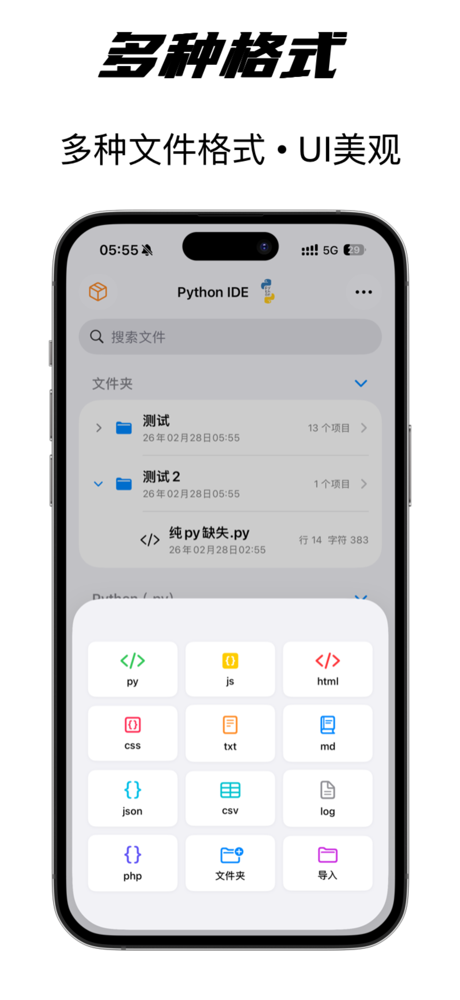

  

<h1 align="center">PythonIDE</h1>
<h3 align="center">掌上的 Python & JavaScript 开发环境</h3>

  <strong>让编程从电脑走到手机与平板</strong> · Write, Run, Debug on iOS

  
  

  
  
  
  

---

## ✨ 核心功能 / Core Features

### 🐍 多语言运行
| 功能 | 描述 |
|------|------|
| **Python 3.13** | 本地运行、完整标准库、交互式 I/O、async/await、多线程 |
| **JavaScript** | JavaScriptCore 执行 .js，alert/confirm/prompt、fetch、localStorage、剪贴板等桥接 |
| **HTML 预览** | WKWebView 加载 HTML+CSS+JS，相对路径、alert/console 桥接，支持 −/+ 按钮与双指捏合缩放 |

### ✏️ 专业代码编辑器
| 功能 | 描述 |
|------|------|
| **语法高亮** | Python、JavaScript、HTML、CSS、JSON、Markdown、LOG 等 |
| **代码自动补全** | 智能提示、补全建议 |
| **自动缩进** | 按语言自动缩进、Tab 宽度可调 |
| **行号栏** | 显示行号、支持大文件 |
| **等宽字体** | 可调字体大小（8–30 号） |
| **查找 & 替换** | 全文搜索、高亮匹配、跳转行 |
| **快捷输入栏** | 按语言（Py/JS/HTML/CSS/JSON/MD）定制符号与 snippets，支持自定义、拖拽排序 |
| **实时保存** | 自动保存、手动保存 |
| **显示空白符** | 可选显示空格、制表符 |
| **捏合缩放** | 双指捏合快速调节字体大小 |
| **分屏模式** | 编辑器与控制台同屏，竖屏上下分割，横屏左右分割（仅 .py） |
| **错误跳转** | 控制台报错含行号时，点击可跳转编辑器对应行 |
| **运行历史** | 查看历史运行记录（时间 + 代码快照），一键重新运行 |

### 📄 多格式编辑与预览
| 类型 | 支持 |
|------|------|
| **可运行** | `.py`（Python）、`.js`（JavaScript） |
| **可预览** | `.html`（全屏网页）、`.css`（套用示例）、`.md`（Markdown 渲染）、`.csv`（表格） |
| **可编辑** | `.json`、`.txt`、`.log`、`.php` 等 |

### 📂 文件管理
| 功能 | 描述 |
|------|------|
| **多层级文件夹** | 无限层级、面包屑导航、点击路径跳转 |
| **文件操作** | 创建、重命名、复制、移动、删除 |
| **文件着色** | 给文件和文件夹设置颜色标记，分类一目了然 |
| **回收站** | 7 天保留、恢复、批量删除、倒计时提示 |
| **置顶** | 文件/文件夹置顶，左滑快速操作 |
| **搜索** | 按文件名搜索、高亮匹配、历史记录 |
| **批量操作** | 多选、批量删除、批量分享 |
| **导入** | 从系统文件应用导入 |
| **排序** | 拖拽排序、按更新时间 |

### 📺 控制台与输出
| 功能 | 描述 |
|------|------|
| **Rich 输出** | ANSI 彩色、进度条、图表可视化完整支持 |
| **多控制台** | 同时运行多个脚本，独立控制台随时切换查看 |
| **交互式输入** | 支持 `input()` 实时键盘输入 |
| **输出设置** | 字体大小、输出速度（慢/正常/快）、行号、自动滚动 |
| **运行历史** | 查看并再次运行历史脚本 |
| **自定义背景** | 控制台背景支持自定义颜色或图片 |

### 🤖 AI 助手

AI 助手深度集成到编辑器工作流中，**开箱即用，无需任何配置**，同时支持接入自己的 API Key 无限使用。

#### 使用方式
| 方式 | 说明 |
|------|------|
| **平台内置** | 注册即赠免费调用次数，直接使用，无需配置 |
| **用量包** | 应用内购买额度，立即到账，余额实时显示 |
| **自带 Key（BYOK）** | 填入自己的 API 地址 + Key，无次数限制，支持多套预设保存切换 |

内置快速预设，一键填入无需手动输入地址：**DeepSeek**、**OpenAI**、**OpenRouter**，以及兼容 OpenAI 格式的任意服务。

#### AI 两种工作模式

**内联修改模式（行内直接改代码）**
- 点击编辑器顶部 ✨ 或键盘上方 ✨ 按钮，输入需求
- AI 直接修改当前文件，以**差异对比（Diff）** 方式展示每一处改动
- 支持逐条**采纳 / 拒绝**，也可一键全部采纳或放弃，支持取消和重试
- 按文件类型自动切换 Prompt：Python / JavaScript / HTML / CSS / Markdown 各有专属助手角色

**AI 聊天模式（多轮对话）**
- 底部弹出对话界面，支持多轮连续对话
- 当前文件内容自动作为上下文传入
- AI 回复中的代码块可一键**应用到编辑器**
- 支持重试和继续追问

#### 其他 AI 联动
- 运行出错时控制台底部弹出**错误卡片**，含 ✨ AI 修复按钮，一键将报错发给 AI 分析并修复
- **智能装库**：AI 检测到代码缺少第三方库时自动提示，弹出确认后**自动下载安装**，用户可选择接受或拒绝，无需手动操作
- System Prompt 支持用户自定义

### 🛠️ 开发者工具箱（10 大工具）
| 工具 | 功能 |
|------|------|
| **编解码** | URL 编解码、Unicode、MD5、Base64 |
| **JSON** | 格式化、压缩、验证 |
| **API 调试** | HTTP 请求测试，自定义 Method / Header / Body，查看响应码与内容 |
| **二维码** | 生成、识别（含识别相册图片）、Data URL |
| **图片 URL** | URL 转图片、图片转 Data URL |
| **HTML 图片** | HTML 转图片、抓图、Data URL |
| **时间戳** | 毫秒/秒互转、日期格式化、时区显示 |
| **进制转换** | 二、八、十、十六进制互转 |
| **正则表达式** | 匹配测试、替换、分组预览 |
| **直链下载** | 自定义请求头（UA/Referer/Cookie/Token）、超时设置、TLS 忽略、进度条、下载完成后直接分享导出 |

工具列表支持**搜索**、**拖拽排序**，可恢复默认顺序。

### 📚 第三方库
| 类别 | 示例 |
|------|------|
| **数据科学** | NumPy、Pandas、Matplotlib、SciPy、scikit-learn |
| **网络** | requests、httpx、aiohttp、urllib3、certifi |
| **加密** | PyCryptodome、cryptography |
| **AI / 数据** | openai、pydantic、beautifulsoup4、lxml |
| **其他** | Pillow、rich、tqdm、loguru 等 150+ 预装 Wheel |

库管理：搜索 PyPI 安装新库、查看已安装、一键卸载，支持 `.whl` 文件直接安装。

### 📷 Photos 模块
- Python 调用相册与相机
- 配合 Pillow 做裁剪、压缩、处理

### 📂 媒体预览
- 图片、视频、PDF、文本、部分音频
- 应用内直接预览，无需跳转其他 App

### 🔒 隐私与体验
| 功能 | 描述 |
|------|------|
| **Face ID / Touch ID** | 应用锁定，保护代码隐私；可设置锁定延迟（立即/1/2/5/30分钟） |
| **4 套图标** | 默认、深色、渐变、极简，即时切换 |
| **外观** | 跟随系统 / 浅色 / 深色 |
| **灵动岛 / 锁屏** | 脚本运行状态（运行中/等待输入/完成/失败）、实时计时、点击跳回 App |
| **后台运行** | 长任务后台继续执行、本地通知、音频保活 |
| **触觉反馈** | 成功/失败/轻提示 |
| **URL Scheme** | `pythonide://`，支持从通知/Widget/快捷指令跳转，可传入下载地址自动填入工具 |
| **Siri / 快捷指令** | 支持 App Intents，通过快捷指令触发运行 Python 脚本 |
| **自定义背景** | 编辑器与控制台背景支持自定义颜色或图片 |
| **启动页** | 动态 Lottie 启动动画，冷启动更流畅 |

---

## 📱 截图 / Screenshots

  
  
  
  
  

  
  
  
  
  

---

## 📥 安装 / Install

| 方式 | 说明 |
|------|------|
| **App Store** | [点击下载](https://apps.apple.com/app/id6753987304) · 推荐 |
| **系统要求** | iOS 16.2+，iPhone / iPad |

---

## 💬 社区与反馈 / Community & Feedback

| 渠道 | 链接 |
|------|------|
| **✈️ Telegram** | [iOS 端 Py 编程 IDE](https://t.me/pythonzwb) |
| **💡 功能建议** | [GitHub Discussions](https://github.com/jinwandalaohu66/PythonIDE-Landing/discussions) |
| **🐛 问题反馈** | [Issues](https://github.com/jinwandalaohu66/PythonIDE-Landing/issues) |
| **📧 邮件** | 应用内「设置 → 反馈」 |
| **⭐ 支持** | 在 App Store 评分、在 GitHub 点 Star |

---

## ☕ 捐赠 / Donate

如果 PythonIDE 对你有帮助，欢迎请我喝杯咖啡，支持后续开发。

  

  <em>扫码赞赏 · Thank you for your support</em>

---

## 🙏 致谢 / Thanks

感谢所有使用和反馈 PythonIDE 的开发者。  
如果你觉得有用，欢迎 **Star** 和 **App Store 评分**，让更多人发现它。

  <strong>PythonIDE</strong> —— 本地、纯粹、实用的移动端编程环境

---

  
    <strong>Topics</strong> · ios · python · javascript · ide · mobile-development · swift · scripting · developer-tools
  

